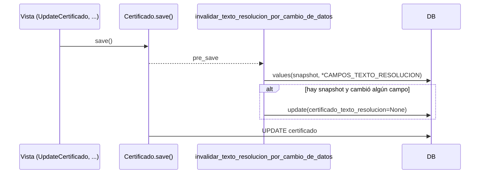

# invalidar_texto_resolucion_por_cambio_de_datos

**Módulo:** `carga/signals.py` (líneas 103-127)

## Propósito

`pre_save` de `Certificado`. `certificado_texto_resolucion` es un snapshot del texto de la
resolución ya resuelto y retocado a mano. Si después cambia alguno de los datos que ese
texto describe (`CAMPOS_TEXTO_RESOLUCION`: obra, tipo, financiamiento, rubro, número,
expediente, período, fecha, montos, devolución, % de fondo de reparo, % mes/anterior/
acumulado/anticipo/etapa), el snapshot quedaría desactualizado y la pantalla de revisión lo
seguiría mostrando igual. La señal lee los valores guardados y, si alguno difiere, anula el
snapshot para que se vuelva a resolver desde la plantilla.

Usa `Certificado.objects.filter(pk=...).update(...)` y no un `save()` ni sólo mutar
`instance`:
- Django arma `update_fields` antes de emitir `pre_save`, así que mutar `instance` no
  alcanza para que se escriba (igual se muta, para que el objeto en memoria quede
  coherente).
- Un `save()` adentro reentraría en la señal y dejaría una segunda fila en
  `certificado_history` por cada edición.

`.update()` no toca los `GeneratedField` con `db_persist`: esos los recalcula la base. En
altas (`instance.pk` vacío) y en certificados sin snapshot no hace nada.

## Firma

```python
def invalidar_texto_resolucion_por_cambio_de_datos(sender, instance, **kwargs):
```

## Uso real

Se dispara sola en cada `Certificado.save()` (form de edición, regeneración desde Foja, etc.). No se llama directamente.

## Flujo de datos



## Ver también

- [Certificado](../models/Certificado.md)
- [editar_texto_resolucion_certificado](../views/textoresolucionviews/editar_texto_resolucion_certificado.md)
- [restaurar_texto_resolucion_certificado](../views/textoresolucionviews/restaurar_texto_resolucion_certificado.md) — el mismo descarte, pero a pedido del usuario.
