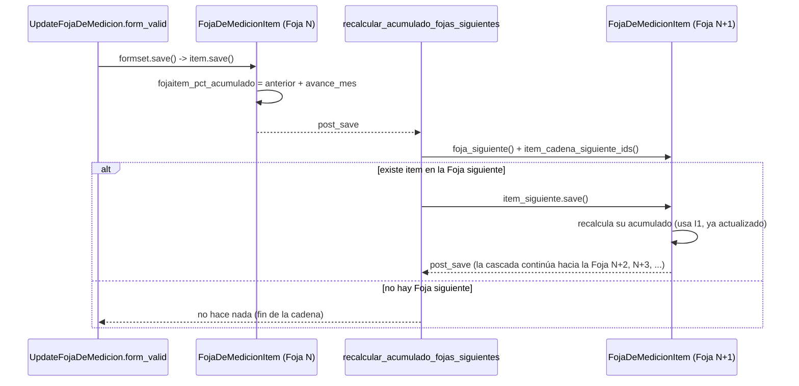

# recalcular_acumulado_fojas_siguientes

**Módulo:** `carga/signals.py` (líneas 42-57) · receiver de `post_save` sobre `FojaDeMedicionItem`

## Propósito

`FojaDeMedicionItem.save()` calcula `fojaitem_pct_acumulado` como una **copia** en el
momento de guardar (`anterior.fojaitem_pct_acumulado + self.fojaitem_pct_avance_mes`), no
como un valor derivado que se recalcula solo. Eso significa que si más tarde se edita el
avance de una Foja anterior, el acumulado de las Fojas posteriores queda desactualizado —
en el peor caso, terminando siendo *menor* que el de la Foja que se acaba de corregir
(inconsistencia contraria a lo esperable en una serie acumulada).

Esta señal es el mecanismo que evita esa desincronización: cada vez que se guarda un
`FojaDeMedicionItem`, busca el item correspondiente en la Foja *siguiente* de la cadena y
lo vuelve a guardar. Como ese `save()` también calcula su acumulado a partir del anterior
(ya actualizado) y también dispara `post_save`, el recálculo se propaga en cascada hacia
adelante hasta la última Foja de la cadena.

"Cadena" acá no es necesariamente orden cronológico de creación: `foja_siguiente()` y
`item_cadena_siguiente_ids()` siguen la cadena de *rubros reprogramados*
(`rubro_cadena_siguiente_ids()`), así que el recálculo también cruza fojas que quedaron en
un plan de trabajos reprogramado distinto del original.

## Firma

```python
def recalcular_acumulado_fojas_siguientes(sender, instance, **kwargs):
```

## Uso real

No se llama nunca directamente — se dispara solo, como cualquier receiver de señal, cada
vez que se guarda un `FojaDeMedicionItem`. El disparador más común es editar una Foja de
Medición desde el formset de items:

```python
# carga/views/fojademedicionviews.py:232 (UpdateFojaDeMedicion.form_valid)
if formset.is_valid():
    formset.instance = self.object
    formset.save()  # guarda cada FojaDeMedicionItem -> post_save -> esta señal
```

## Flujo de datos



La recursión es implícita: la propia señal no se llama a sí misma, sino que cada
`item_siguiente.save()` dispara un nuevo `post_save` que Django despacha al mismo
receiver — la cascada termina sola cuando `foja_siguiente()` devuelve `None`.

## Ver también

- [FojaDeMedicionItem](../models/FojaDeMedicionItem.md) — su `save()` es el que dispara esta señal y el que define cómo se calcula `fojaitem_pct_acumulado`.
- [FojaDeMedicion](../models/FojaDeMedicion.md) — `foja_siguiente()`/`foja_anterior()` son los que arman la cadena que esta señal recorre.
