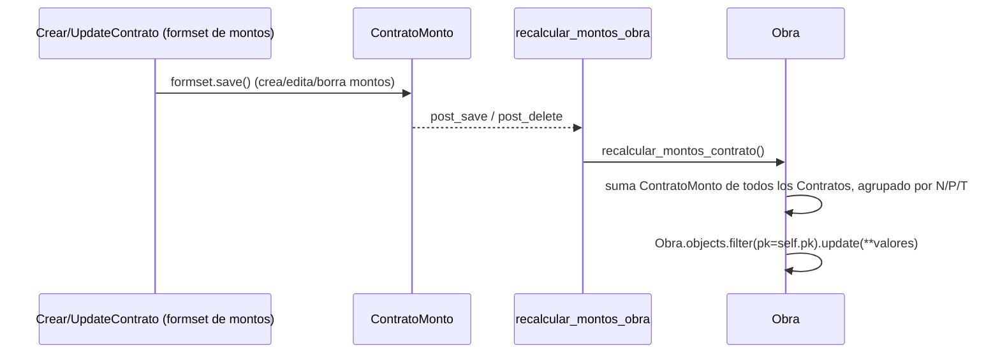

# recalcular_montos_obra

**Módulo:** `carga/signals.py` (líneas 62-64) · receiver de `post_save` **y** `post_delete` sobre `ContratoMonto`

## Propósito

`Obra` guarda campos desnormalizados (`obra_contrato_{nacion,provincia,terceros}_{pesos,uvi,uvi_fecha}`)
que son, en rigor, una agregación de los `ContratoMonto` de todos los Contratos de esa
Obra. Esta señal es lo que mantiene esa desnormalización sincronizada: cada vez que se
crea, edita o borra un `ContratoMonto`, delega en
`Obra.recalcular_montos_contrato()` (ver [Obra](../models/Obra.md)), que vuelve a sumar
todos los montos agrupados por código de financiamiento (N/P/T) y pisa los campos de la
Obra con `queryset.update(...)`.

Está enganchada tanto a `post_save` como a `post_delete` (dos `@receiver` apilados sobre
la misma función) porque borrar un `ContratoMonto` también debe disparar el recálculo —
si solo escuchara `post_save`, borrar el último monto de un financiamiento dejaría el
campo desnormalizado de la Obra con un valor viejo que ya no tiene respaldo.

## Firma

```python
def recalcular_montos_obra(sender, instance, **kwargs):
```

## Uso real

No se llama directamente. Se dispara al guardar el formset inline de montos de un
Contrato:

```python
# carga/views/contratoviews.py (CrearContrato/UpdateContrato, vía FormsetViewMixin)
formset_name = ContratoMontoFormset
# formset.save() -> cada ContratoMonto.save()/delete() -> post_save/post_delete -> esta señal
```

## Flujo de datos



`recalcular_montos_contrato()` usa `queryset.update()` en vez de `instance.save()`
justamente para no volver a disparar señales sobre la propia `Obra` — evita un loop y dos
UPDATE innecesarios si el Contrato también tuviera lógica en `post_save`.

## Ver también

- [Obra](../models/Obra.md) — dueña de los campos desnormalizados y del método `recalcular_montos_contrato()` que esta señal invoca.
- [ContratoMonto](../models/ContratoMonto.md)
