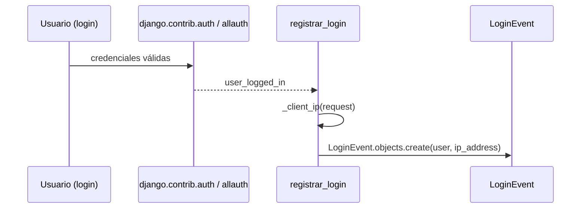

# registrar_login

**Módulo:** `core/signals.py` (líneas 15-17)

## Propósito

Receiver de la señal estándar de Django `user_logged_in`: crea un `LoginEvent` en cada inicio de sesión exitoso, para poder graficar actividad de usuarios en el dashboard — el único uso de señales propio de `core` (todas las de `carga`/`secretariador` son sobre modelos de negocio; esta es sobre autenticación).

## Firma

```python
def registrar_login(sender, request, user, **kwargs):
```

## Uso real

Se dispara solo, en cada login exitoso (cualquier vista de `allauth` o `django.contrib.auth`) — no se llama directamente.

## Flujo de datos



## Ver también

- [LoginEvent](../models/LoginEvent.md)
- [_client_ip](_client_ip.md)
