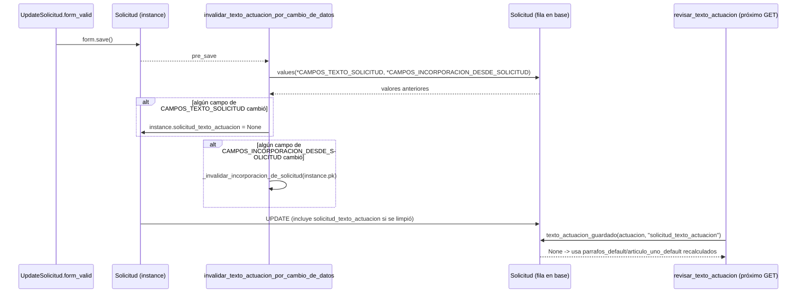

# invalidar_texto_actuacion_por_cambio_de_datos

**Módulo:** `secretariador/signals.py` (líneas 84-106) · receiver de `pre_save` sobre `Solicitud`

## Propósito

Arregla un bug real: `revisar_texto_actuacion` (`textoactuacionviews.py`) usa
`solicitud_texto_actuacion` como valor inicial del formulario de edición de texto —y
`_generar_solicitud_docx`/`_generar_exterior_docx` lo usan directo para el `.docx`— sin
ninguna reconciliación contra los datos actuales de la Solicitud. Antes de esta señal, una
vez que alguien guardaba el texto a mano una vez, quedaba "congelado": si después se
editaban los agentes, fechas, localidades o vehículo de la Solicitud, tanto el formulario
de revisión como el `.docx` seguían mostrando el texto viejo, sin reflejar el cambio.

Esta función compara, en el `pre_save` de cada guardado de `Solicitud`, los valores en
base de datos contra los valores en memoria de `instance` para los campos que alimentan
`_calcular_texto_solicitud`/`_calcular_texto_exterior` (`CAMPOS_TEXTO_SOLICITUD`: fechas,
tareas, vehículo, ciudad/provincia, decreto de viáticos, día inhábil, número de actuación).
Si alguno cambió, pone `instance.solicitud_texto_actuacion = None` — al no estar en
`update_fields` de un guardado explícito de solo-texto (ver más abajo), esto vuelve a
forzar el recálculo la próxima vez que se abra el formulario o se genere el `.docx`.

De paso también compara un segundo set de campos (`CAMPOS_INCORPORACION_DESDE_SOLICITUD`)
que no afectan el texto de la propia Solicitud pero sí el de una `Incorporacion` asociada
(p. ej. `solicitud_resolucion`, que `_calcular_texto_incorporacion` lee vía
`incorporacion_solicitud.solicitud_resolucion` pero que ninguna redacción de Solicitud usa
directamente) — si esos cambiaron, invalida la Incorporacion vía
[_invalidar_incorporacion_de_solicitud](_invalidar_incorporacion_de_solicitud.md).

**Por qué no se pisa a sí misma al guardar el texto:** cuando `revisar_texto_actuacion`
persiste el texto editado a mano
(`actuacion.save(update_fields=["solicitud_texto_actuacion"])`), la instancia que llega
acá ya viene de un `Solicitud.objects.get(pk=pk)` fresco — ningún otro campo cambió, así
que `cambio(CAMPOS_TEXTO_SOLICITUD)` da `False` y el texto recién guardado sobrevive.

**Por qué se compara contra la base en vez de contra `instance._state`:** un `pre_save` no
tiene acceso directo al valor "antes de esta asignación" salvo que Django lo haya cargado
él mismo; la forma simple y explícita es traer los valores actuales de la fila con una
consulta (`Solicitud.objects.filter(pk=instance.pk).values(*campos)`) y comparar contra
`instance` normalizado con [_valor_comparable](_valor_comparable.md) — ver ahí por qué
hace falta esa normalización y no alcanza con `!=` directo.

## Firma

```python
def invalidar_texto_actuacion_por_cambio_de_datos(sender, instance, **kwargs):
```

## Uso real

No se llama nunca directamente — se dispara solo en cada `Solicitud.save()`, sea desde
`UpdateSolicitud`/`UpdateSolicitudExterior` (edición del formulario principal) o desde
`revisar_texto_actuacion` al persistir el texto. El disparador típico del bug que arregla:

```python
# secretariador/views/solicitudviews.py (UpdateSolicitud, vía FormsetViewMixin.form_valid)
self.object = form.save()  # cambia solicitud_fecha_hasta -> pre_save -> esta señal
```

## Flujo de datos



## Ver también

- [_valor_comparable](_valor_comparable.md)
- [_invalidar_incorporacion_de_solicitud](_invalidar_incorporacion_de_solicitud.md)
- [Solicitud](../models/Solicitud.md)
- [revisar_texto_actuacion](../views/textoactuacionviews/revisar_texto_actuacion.md)
- [_generar_solicitud_docx](../views/solicitudviews/_generar_solicitud_docx.md)
