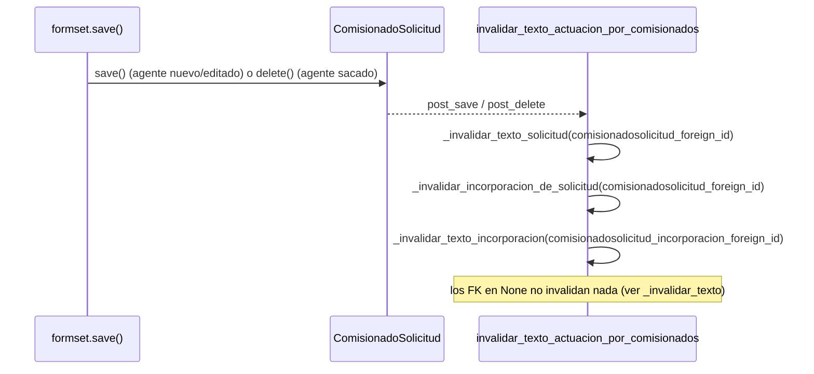

# invalidar_texto_actuacion_por_comisionados

**Módulo:** `secretariador/signals.py` (líneas 129-135) · receiver de `post_save` y `post_delete` sobre `ComisionadoSolicitud`

## Propósito

`ComisionadoSolicitud` es la tabla de agentes comisionados, y alimenta la prosa del texto
por dos caminos distintos según a qué esté enganchada:

- `comisionadosolicitud_foreign` (agente de la Solicitud original, "agentes_solicitud"):
  afecta tanto el texto de esa Solicitud (`_calcular_texto_solicitud`/
  `_calcular_texto_exterior`) como el de su Incorporacion, si tiene una — porque
  `_calcular_texto_incorporacion` menciona explícitamente a los agentes de la Solicitud
  original además de los incorporados.
- `comisionadosolicitud_incorporacion_foreign` (agente agregado directo en la
  Incorporacion, "agentes_incorporacion"): afecta solo el texto de esa Incorporacion.

Un mismo `ComisionadoSolicitud` tiene como mucho uno de los dos FK cargado (son excluyentes
en la práctica, aunque no hay `CheckConstraint` que lo fuerce como sí lo hay para
`comisionadosolicitud_nombre`/`comisionadosolicitud_externo`), así que en cada guardado o
borrado esta función simplemente intenta invalidar los tres posibles destinos — las
llamadas con `pk=None` (`comisionadosolicitud_foreign_id`/`comisionadosolicitud_incorporacion_foreign_id`
en `None`) no hacen nada, por el `if not pk` de [_invalidar_texto](_invalidar_texto.md).

Se engancha a `post_save` **y** `post_delete` (no solo `post_save`) porque borrar un
agente comisionado —p. ej. sacarlo de la Solicitud— también deja desactualizado el texto
guardado tanto como agregarlo o editar su rol de chofer/colaborador.

## Firma

```python
def invalidar_texto_actuacion_por_comisionados(sender, instance, **kwargs):
```

## Uso real

No se llama nunca directamente — se dispara sola en cada `ComisionadoSolicitud.save()`/
`.delete()`. El disparador más común es guardar el formset de comisionados de una
Solicitud o Incorporacion:

```python
# core/mixins.py (FormsetViewMixin.form_valid)
formset.instance = self.object
formset.save()  # guarda/borra cada ComisionadoSolicitud -> post_save/post_delete -> esta señal
```

## Flujo de datos



## Ver también

- [_invalidar_texto_solicitud](_invalidar_texto_solicitud.md)
- [_invalidar_incorporacion_de_solicitud](_invalidar_incorporacion_de_solicitud.md)
- [_invalidar_texto_incorporacion](_invalidar_texto_incorporacion.md)
- [ComisionadoSolicitud](../models/ComisionadoSolicitud.md)
