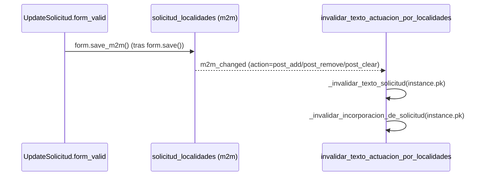

# invalidar_texto_actuacion_por_localidades

**Módulo:** `secretariador/signals.py` (líneas 121-124) · receiver de `m2m_changed` sobre `Solicitud.solicitud_localidades.through`

## Propósito

`solicitud_localidades` es un `ManyToManyField`, así que agregar/quitar una localidad no
pasa por `Solicitud.save()` — Django lo maneja con `add()`/`remove()`/`clear()` sobre la
tabla intermedia, sin disparar `pre_save`/`post_save` de `Solicitud`. Como
`_calcular_texto_solicitud`/`_calcular_texto_incorporacion` sí usan
`solicitud_localidades` (vía `docx_texto.generate_localidad_list`), esta señal aparte es
necesaria: sin ella, cambiar las localidades de una Solicitud no invalidaría el texto
guardado, igual que el bug original con fechas/agentes/vehículo.

Solo actúa en `post_add`/`post_remove`/`post_clear` (después de que el cambio ya se
aplicó a la tabla intermedia) — ignora `pre_add`/`pre_remove`/`pre_clear` para no
invalidar dos veces por la misma operación. Invalida tanto el texto de la propia
Solicitud como el de su Incorporacion asociada, si tiene una.

## Firma

```python
def invalidar_texto_actuacion_por_localidades(sender, instance, action, **kwargs):
```

## Uso real

No se llama nunca directamente — Django la dispara sola en cada
`solicitud.solicitud_localidades.add(...)`/`.remove(...)`/`.clear()`. En la práctica, la
dispara `form.save_m2m()`, que `UpdateView`/`CreateView` llaman automáticamente después de
`form.save()` cuando el `ModelForm` incluye un campo m2m (`solicitud_localidades` está en
`SolicitudForm.Meta.fields`).

## Flujo de datos



## Ver también

- [_invalidar_texto_solicitud](_invalidar_texto_solicitud.md)
- [_invalidar_incorporacion_de_solicitud](_invalidar_incorporacion_de_solicitud.md)
- [invalidar_texto_actuacion_por_cambio_de_datos](invalidar_texto_actuacion_por_cambio_de_datos.md) — misma invalidación, para los campos escalares de Solicitud.
- [Solicitud](../models/Solicitud.md)
